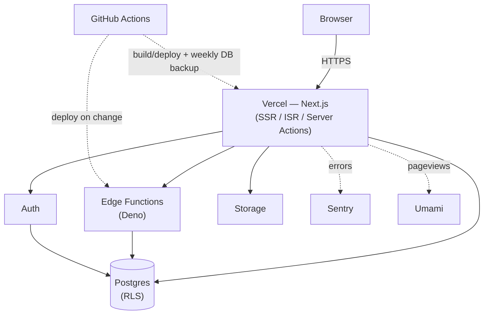

# shigakogen

[](https://github.com/Kichirou58/shigakogen/actions/workflows/ci.yml)

Portfolio + blog kỹ thuật cá nhân của một Backend Developer. Next.js (App Router) trên Vercel,
dữ liệu và backend logic (Postgres + RLS, Edge Functions, Auth, Storage) hoàn toàn trên Supabase
Cloud.

Xem trực tiếp: [shigakogen.site](https://shigakogen.site) · Giải thích kiến trúc:
[/architecture](https://shigakogen.site/architecture)

## Kiến trúc



Chi tiết từng luồng dữ liệu (đọc bài viết, view counter, đăng bài, tìm kiếm) xem ở trang
[/architecture](https://shigakogen.site/architecture) trên site, hoặc `docs/00-SPEC.md` /
`docs/02-API.md` trong repo.

## Stack

| Lớp         | Công nghệ                                                  |
| ----------- | ----------------------------------------------------------- |
| Framework   | Next.js (App Router) + TypeScript strict                    |
| Styling     | Tailwind CSS v4 + shadcn/ui                                 |
| Content     | Supabase Postgres (bài viết lưu dạng Markdown/MDX text)     |
| Render MDX  | next-mdx-remote (RSC) + rehype-pretty-code (Shiki)           |
| Backend API | Supabase Edge Functions (Deno + TypeScript)                 |
| Auth        | Supabase Auth (magic link, 1 admin user)                     |
| Storage     | Supabase Storage (ảnh bài viết, resume PDF)                 |
| Observability | Sentry (error tracking) + Umami (analytics)                |
| Deploy FE   | Vercel                                                       |
| Deploy BE   | `supabase functions deploy` (qua GitHub Actions)              |

## Chạy local

Yêu cầu: Node 20+, pnpm, và một project Supabase (cloud hoặc local qua `supabase start`).

```bash
git clone git@github.com:Kichirou58/shigakogen.git && cd shigakogen
cp .env.example .env.local   # điền NEXT_PUBLIC_SUPABASE_URL / ANON_KEY của bạn
pnpm install && pnpm dev
```

Mở [http://localhost:3000](http://localhost:3000). Không có Supabase project riêng? Chạy
`supabase start` (cần Docker) để có stack local đầy đủ + seed data, các key local sẽ được in ra
console.

### Lệnh khác

```bash
pnpm build               # build production (phải pass trước khi commit)
pnpm lint                # eslint
pnpm typecheck           # tsc --noEmit

supabase db push                     # đẩy migration lên project remote
supabase functions deploy <name>     # deploy 1 Edge Function
```

Chi tiết migration/RLS/Edge Function xem `docs/01-DATABASE.md`, `docs/02-API.md`. Danh sách task
+ trạng thái xem `docs/03-ROADMAP.md`.

## License

Source code để tham khảo/học hỏi. Không có license mở — liên hệ trước nếu muốn tái sử dụng.
